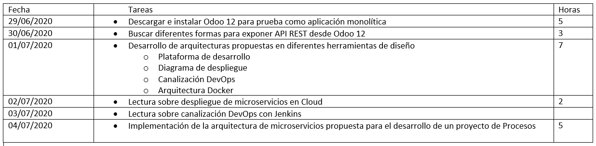
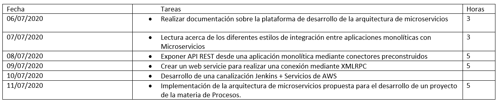
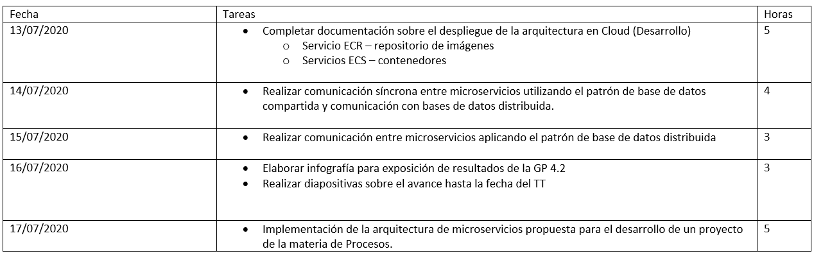
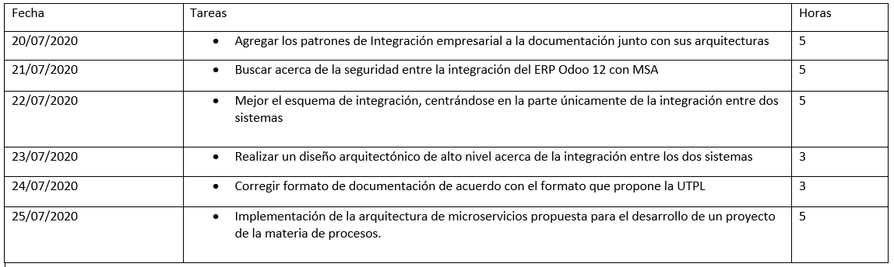

# PlanificacionesSemanales
Este repositorio está dedicado a la planificación semanal. Vamos a realizar la presentación.
## Con título indicamos: Planificación semana 12: 29 de junio al 5 de julio 2020
Insertamos la captura de la planificación semana 12
(* **Hito más importante de la semana**: Diseños arquitectónicos

* **Actividades logradas**: Se lograron todas las tareas a exceptición de la ultima tareas, debido a que esta tarea es planificada semana a semana, por lo cual se van realizando entregables semanalmente

## Con título indicamos: Planificación semana 13: 6 al 12 de julio 2020
Insertamos la captura de la planificación semana 13
* **Hito más importante de la semana**: Exponer API Rest del ERP Odoo 12

* **Actividades logradas**: Se lograron todas las tareas a exceptición de la ultima tareas, debido a que esta tarea es planificada semana a semana, por lo cual se van realizando entregables semanalmente
## Con título indicamos: Planificación semana 14: 13 al 19 de julio 2020
Insertamos la captura de la planificación semana 14
* **Hito más importante de la semana 14**: Comunicación distriubuida entre microservicios

* **Actividades logradas**: Se lograron todas las tareas a exceptición de la ultima tareas, debido a que esta tarea es planificada semana a semana, por lo cual se van realizando entregables semanalmente

## Con título indicamos: Planificación semana 15: 20 al 26 de julio 2020
Insertamos la captura de la planificación semana 15
* **Hito más importante de la semana 15**: Seguridad en la capa de integración entre dos sistemas con arquitecturas diferentes

* **Actividades logradas**: Se lograron todas las tareas a exceptición de la ultima tareas, debido a que esta tarea es planificada semana a semana, por lo cual se van realizando entregables semanalmente

Y así seguiremos llenando hasta la semana 16.
Exitos! 
